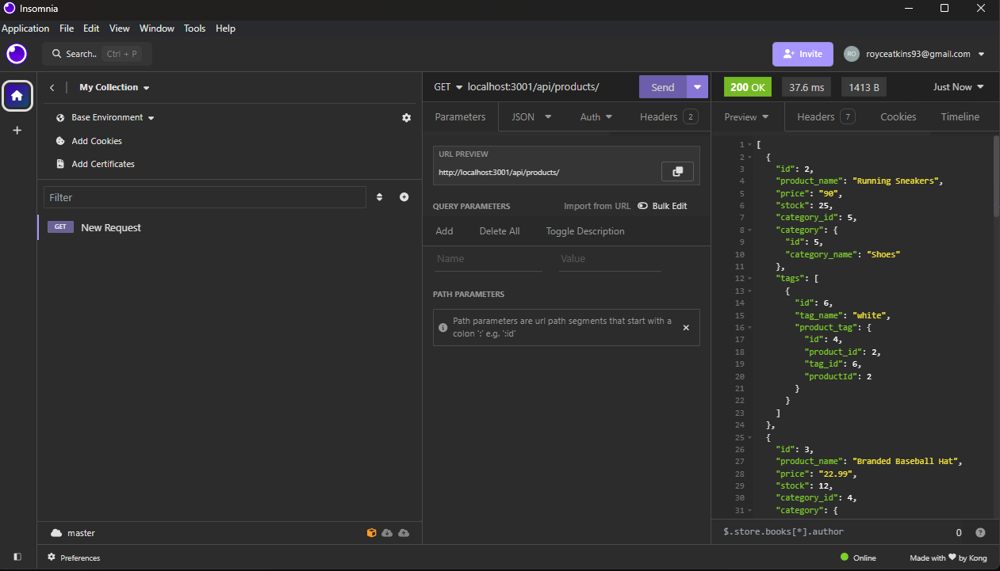
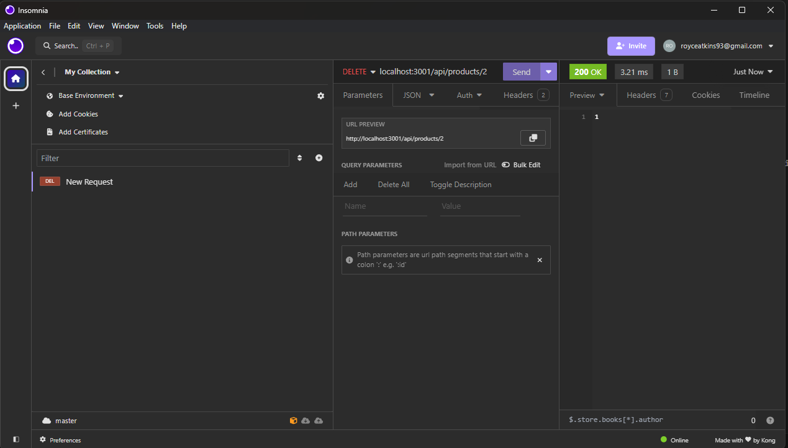
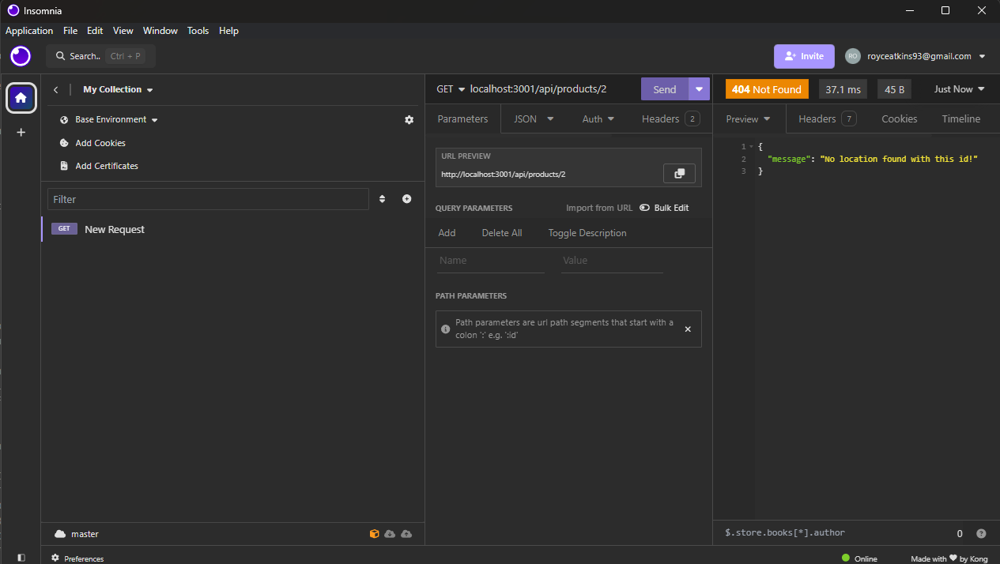

# Royces-ecommerce-backend
Creating the backend for an ecommerce page.

## Description

- This is a database application that allows you to view and edit all products, categories, and tags in json with requests.
- With insomnia you can also post, put and delete.

## Table of Contents

- [Installation](#installation)
- [Usage](#usage)
- [Credits](#credits)
- [License](#license)

## Installation

In terminal run 
- "npm i"
- "psql -U postgres"
- enter you password
In postgres run
- "\i schema.sql"
- "\q"
Back in the terminal.
- "node server.js"

## Usage
GET, POST, PUT and DELETE capabilities!

Doing a get all:

Deleting a product by id:

Showing the product has been deleted by getting the individual product id that no longer exists:

## Credits

I had a lot of help from my classmates, specifically Christian Abbate. Christian and I worked together to figure out and complete everything in this homework assignment. It was challenging but we did it! I also had help from our TA's so much thanks to them! 

## License

MIT License

Copyright (c) 2024 Wartech93

Permission is hereby granted, free of charge, to any person obtaining a copy
of this software and associated documentation files (the "Software"), to deal
in the Software without restriction, including without limitation the rights
to use, copy, modify, merge, publish, distribute, sublicense, and/or sell
copies of the Software, and to permit persons to whom the Software is
furnished to do so, subject to the following conditions:

The above copyright notice and this permission notice shall be included in all
copies or substantial portions of the Software.

THE SOFTWARE IS PROVIDED "AS IS", WITHOUT WARRANTY OF ANY KIND, EXPRESS OR
IMPLIED, INCLUDING BUT NOT LIMITED TO THE WARRANTIES OF MERCHANTABILITY,
FITNESS FOR A PARTICULAR PURPOSE AND NONINFRINGEMENT. IN NO EVENT SHALL THE
AUTHORS OR COPYRIGHT HOLDERS BE LIABLE FOR ANY CLAIM, DAMAGES OR OTHER
LIABILITY, WHETHER IN AN ACTION OF CONTRACT, TORT OR OTHERWISE, ARISING FROM,
OUT OF OR IN CONNECTION WITH THE SOFTWARE OR THE USE OR OTHER DEALINGS IN THE
SOFTWARE.

---

## Features

- Maintaining a database for an e commerce store. This is really an example of what can be done for a back-end for a e commerce store. 

## Links

Google Drive Video Link: https://drive.google.com/file/d/19INJ1_WMV5P8wSsxbkJvPSK2iqj3-q0A/view

Github Repository: 